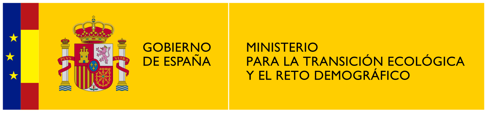

---

<div style="display: flex; align-items: center; justify-content: space-between;">
  
  
  
</div>

---

# <p align="center"> **Material para el Segundo Hackathon** </p>


## **Contenido**

[1. Overview](#overview)

[2. Estructura del proyecto](#estructura-del-proyecto)

[3. Disclaimer](#disclaimer)

## **Overview**
Este repositorio contiene las guías e instrucciones técnicas necesarias para que los equipos puedan desarrollar los casos de uso del **Segundo Hackathon del Programa Nacional de Algoritmos Verdes** sobre "[soluciones de GenAI para la biodiversidad](https://algoritmosverdes.gob.es/es/hackathon/soluciones-genai-para-la-biodiversidad)".

## **Estructura del proyecto**

```bash
content/
├── 100_data/
│   ├── 101_api_eidos_iepnb.ipynb
│   ├── 102_api_red_natura_iepnb.ipynb
│   ├── 103_api_geoserver.ipynb
│   ├── 104_generate_qa_dataset.ipynb
│   └── 105_energy_consumption.ipynb
├── 200_help/
│   ├── 201_inferencia.ipynb
│   ├── 202_fine_tune.ipynb
│   ├── 203_codecarbon_implementation.ipynb
│   └── 204_ALIA.ipynb
```

## **Disclaimer**

Este material es un notebook de demostración **orientativo** sobre la metodología que se debe seguir, no se debe replicar el desarrollo del caso de uso.

El proyecto se ha desarrollado utilizando:

- python 3.12.
- python módulos de python descritos en requirements.txt
